# 🌱 Faseela

<p align="center">
  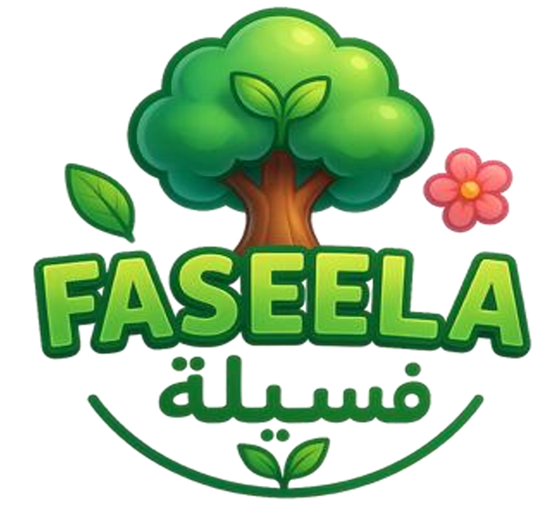
</p>

<p align="center">
  <strong>An Interactive Educational Game for Environmental Awareness and Sustainable Practices</strong>
</p>

---

## 📖 Overview

**Faseela** is an interactive educational game designed to teach children about environmental awareness, sustainability, and the basic stages of planting and caring for a tree.

The game follows the journey of **Harith**, a 9-year-old boy, who learns about nature and planting with the guidance of **Uncle Saleem**, an experienced farmer. Through interactive gameplay, players complete a series of agricultural activities, including clearing the land, preparing the soil, planting seeds, adding fertilizer, and watering a tree.

Faseela combines storytelling, 3D graphics, interactive gameplay, sound effects, and rewards to create an engaging learning experience.

The project supports environmental awareness and aligns with:

- 🌍 SDG 13 — Climate Action
- 🌱 SDG 15 — Life on Land
- ♻️ SDG 12 — Responsible Consumption and Production
- 🇸🇦 Saudi Vision 2030
- 🌳 Saudi Green Initiative

---

## 🌍 Project Goal

Faseela aims to make environmental education more engaging by allowing children to learn through interaction and play.

By combining education, storytelling, sustainability, and 3D game development, the project encourages players to understand how their actions contribute to caring for the environment and building a greener future.

---

## 📑 Table of Contents

- [Overview](#-overview)
- [Project Goal](#-Project-Goal)
- [Game Story](#-game-story)
- [Game Features](#-game-features)
- [Gameplay](#-gameplay)
- [Technologies](#-technologies)
- [Game Mechanics](#-game-mechanics)
- [OpenGL Component](#-opengl-component)
- [Game Screenshots](#-game-screenshots)
- [3D Assets](#-3d-assets)
- [Challenges](#-challenges)
- [Team](#-team)

---

## 🎮 Game Story

The player follows Harith on a journey to plant and grow a tree.

With guidance from Uncle Saleem, the player learns about the importance of preparing the land, planting seeds, caring for the soil, and watering the tree.

The game progresses through the following stages:

1. **Welcome and Introduction**
2. **Clearing the Land**
3. **Preparing the Soil**
4. **Planting the Seeds**
5. **Adding Fertilizer**
6. **Watering the Tree**
7. **Tree Growth**
8. **Congratulations**

Players earn stars as rewards for successfully completing major tasks.

---

## ✨ Game Features

### 🎓 Educational Gameplay

The game teaches children about:

- Basic planting processes
- Environmental responsibility
- Tree care
- Sustainable practices
- Biodiversity awareness
- Responsible resource management

### 🌳 Interactive Tasks

Players actively perform different farming activities:

- Remove rocks from the land
- Dig the soil
- Plant seeds
- Add fertilizer
- Water the tree
- Observe the tree's growth

### ⭐ Star Reward System

Players receive stars after completing major tasks.

The reward system provides:

- Visual feedback
- Sound effects
- Star animations
- Progress tracking
- Motivation to complete the game

### 🌱 Tree Growth System

After watering the tree, the game visually displays its growth through multiple predefined stages.

### 💬 Dialogue System

The game includes dialogues between Harith and Uncle Saleem.

The dialogue system:

- Displays the speaker's name
- Shows sentences sequentially
- Uses a typing effect
- Guides the player through each stage

### 🔊 Sound Effects

Sound effects are integrated to improve immersion during interactions such as:

- Tool activation
- Digging
- Planting seeds
- Adding fertilizer
- Watering
- Receiving stars

### 🎨 Child-Friendly 3D Graphics

The game uses colorful, cartoon-style 3D graphics designed to create an engaging experience for children.

---

## 🕹️ Gameplay

### 1. Clearing the Land

The player selects a **fork tool** and removes rocks from the land.

After all required rocks are removed, the player earns the first star.

```text
Select Fork
     ↓
Activate Tool
     ↓
Click on Rocks
     ↓
Remove All Rocks
     ↓
Earn ⭐
```

### 2. Preparing the Soil

The player uses a **shovel** to prepare and dig the soil.

The ground visually changes based on the player's interactions.

```text
Select Shovel
     ↓
Dig the Ground
     ↓
Prepare the Soil
     ↓
Continue to Planting
```

### 3. Planting the Seeds

After preparing the soil, the player selects the seed bag.

The seeds are dropped into the prepared area with randomized positions to simulate a natural planting process.

```text
Prepare Soil
     ↓
Select Seed Bag
     ↓
Drop Seeds
     ↓
Complete Planting Step
```

### 4. Adding Fertilizer

The player spreads fertilizer after planting the seeds.

Fertilizer particles are generated to simulate natural distribution.

```text
Plant Seeds
     ↓
Select Fertilizer
     ↓
Spread Fertilizer
     ↓
Complete the Stage
```

### 5. Watering the Tree

The player uses a watering can to water the planted area.

Water particles and sound effects are triggered during the interaction.

```text
Select Watering Can
        ↓
Move to Tree
        ↓
Pour Water
        ↓
Trigger Tree Growth
        ↓
Earn ⭐
```

### 6. Tree Growth

After watering, the tree grows through multiple visual stages.

```text
Water Tree
    ↓
Growth Stage 1 🌱
    ↓
Growth Stage 2 🌿
    ↓
Growth Stage 3 🌳
```

---

## 🛠️ Technologies

| Technology | Purpose |
|---|---|
| Unity | Game development and scene management |
| C# | Gameplay logic and game systems |
| Blender | Creating and designing 3D models |
| OpenGL | 3D graphics rendering component |
| JOGL | OpenGL integration in Java |
| Unity Particle System | Water and interaction effects |

---

## ⚙️ Game Mechanics

### Star Reward System

The `StarManager` tracks player progress and grants rewards when major tasks are completed.

The system:

- Prevents duplicate rewards
- Changes the star sprite
- Plays a reward sound
- Animates the star
- Tracks the number of earned stars

### Interactive Object System

The game allows players to interact with objects through mouse clicks.

For example:

- Clicking the fork activates land clearing
- Clicking rocks removes them
- Clicking the shovel changes the ground state
- Clicking the seed bag starts the planting sequence
- Clicking the fertilizer bag starts the fertilizing sequence
- Clicking the watering can triggers tree growth

### Scene Management

The game uses multiple scenes to organize the gameplay progression.

```text
Start Screen
     ↓
Introduction
     ↓
Clearing the Land
     ↓
Dialogue
     ↓
Planting the Seeds
     ↓
Dialogue
     ↓
Watering the Tree
     ↓
Final Dialogue
     ↓
Congratulations
```

### Dialogue System

The dialogue system consists of:

- `DialogueManager`
- `DialogueTrigger`
- `Dialogue`
- Scene transition controls

It displays conversations between the characters and guides the player through the game's educational journey.

---


---

## 🖥️ OpenGL Component

The project also includes an OpenGL implementation for rendering a 3D tree scene.

The implementation includes:

- GLCanvas setup
- 60 FPS animation
- Depth testing
- Lighting
- Ambient, diffuse, and specular effects
- Perspective projection
- Camera positioning
- Continuous scene rotation

The rendered tree consists of:

- Cylindrical trunk
- Cylindrical branches
- Cone-shaped leaf layers
- Shadow effects

---

## 📸 Game Screenshots

### Start Screen

<p align="center">
  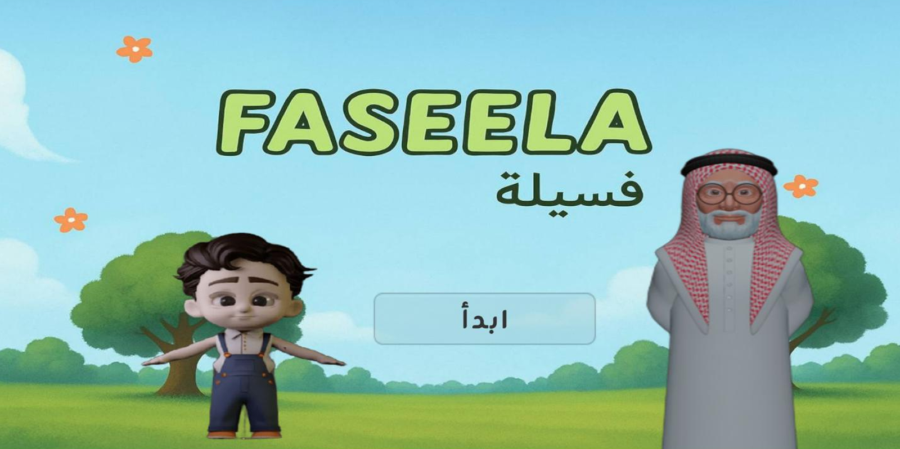
</p>

### Clearing the Land

<p align="center">
  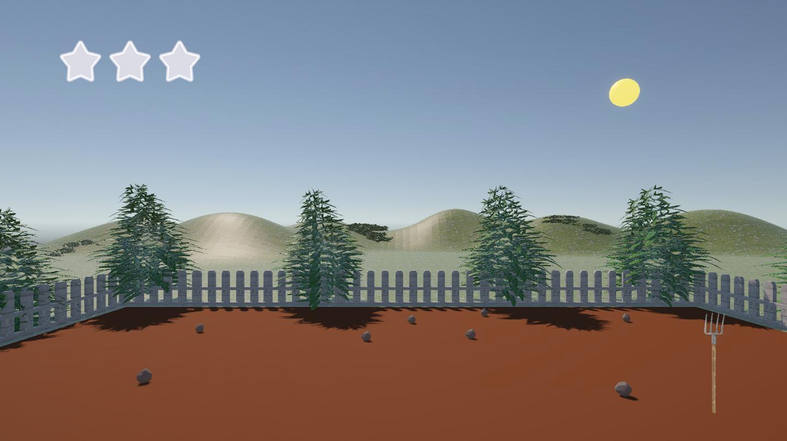
</p>

### Planting the Seeds

<p align="center">
  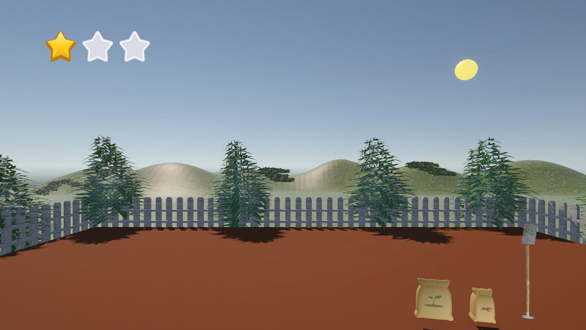
</p>

### Watering the Tree

<p align="center">
  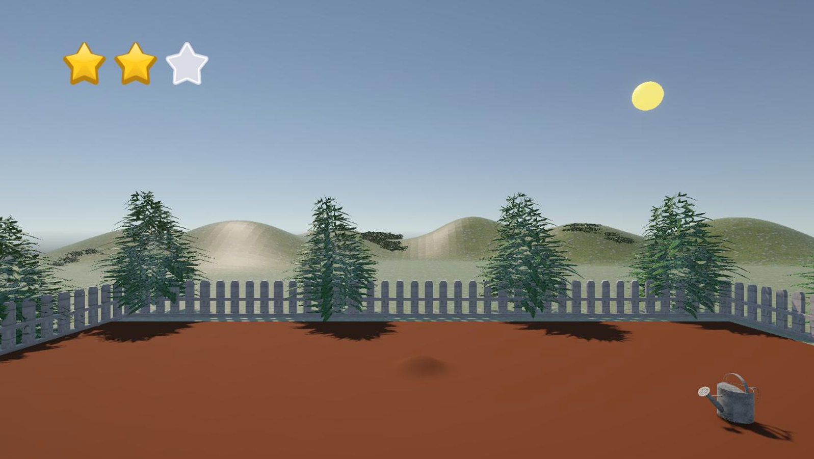
</p>

---

## 🧱 3D Assets

The game environment includes various 3D objects, such as:

- Harith
  <p align="center">
  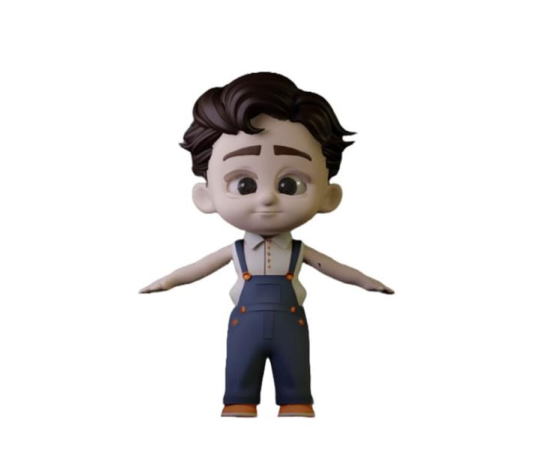
  </p>
- Uncle Saleem
  <p align="center">
  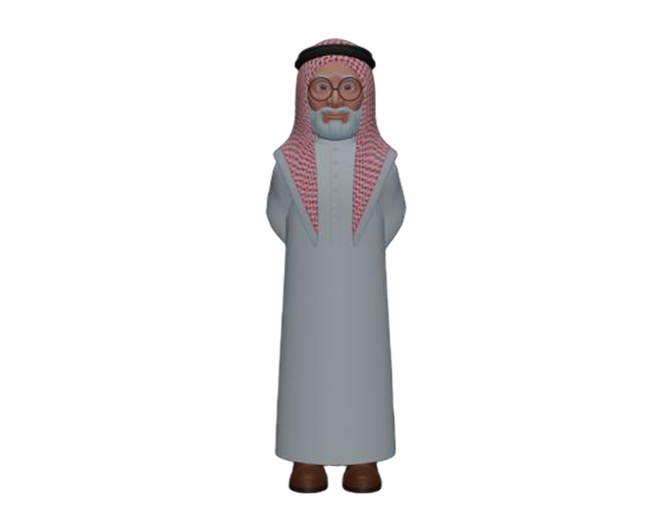
  </p>
- Tree growth stages
  <p align="center">
  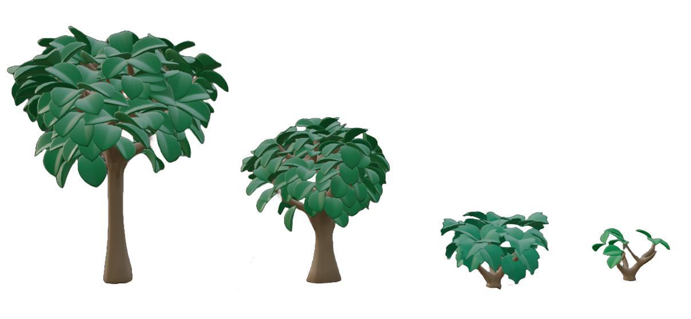
  </p>
- Soil & Rocks
  <p align="center">
  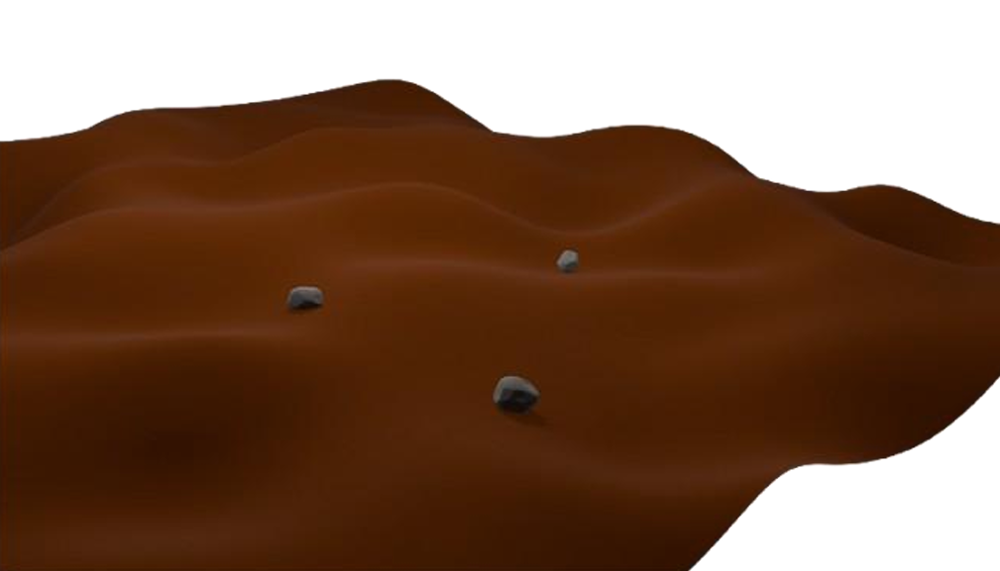
  </p>
- Fence
  <p align="center">
  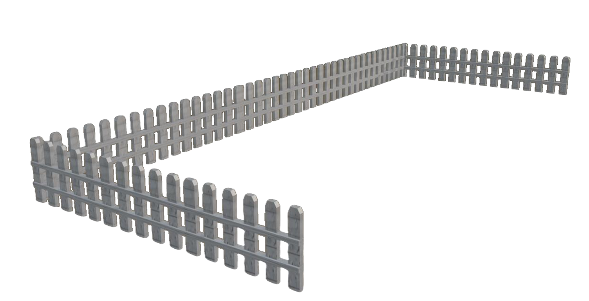
  </p>
- Fork
  <p align="center">
  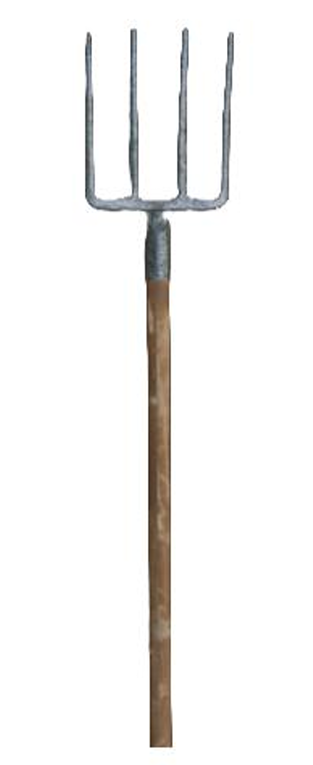
  </p>
- Shovel
  <p align="center">
  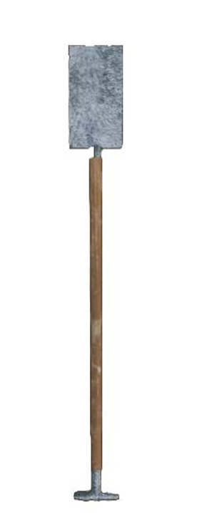
  </p>
- Watering can
  <p align="center">
  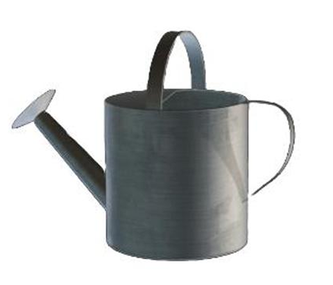
  </p>
- Seeds & Fertilizer
  <p align="center">
  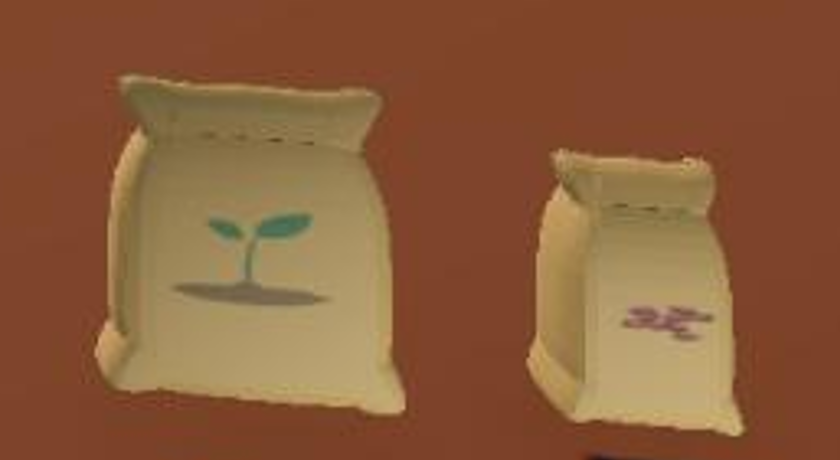
  </p>
- Environmental objects
  <p align="center">
  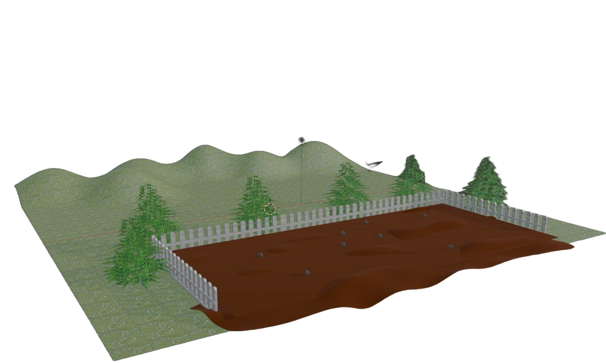
  </p>

The 3D models were created using Blender and integrated into Unity.

---

## ⚠️ Challenges

### Arabic Text Support

One challenge encountered during development was that Unity did not natively support properly rendering Arabic text.

Arabic characters appeared reversed and disconnected.

This issue was addressed by integrating a pre-built solution to correctly render and display Arabic text.

---


## 👥 Team

- Sarah Algarni
- Shatha Alshaikh
- Shayma Aljuaid
- Lujain Alqarni
- Ohoud Alzahrani
- Lina AlSihman

---


<p align="center">
  🌱 <strong>Plant, Learn, Grow.</strong> 🌳
</p>
